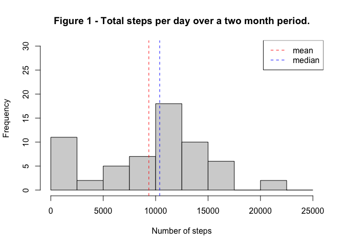
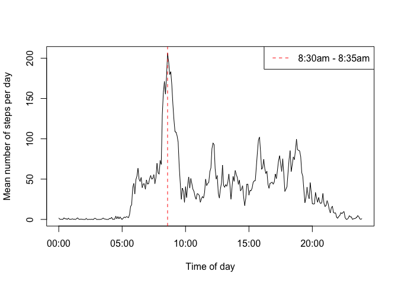
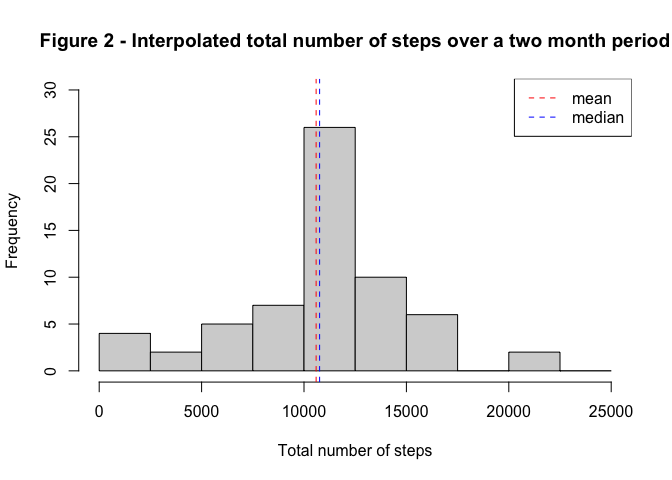
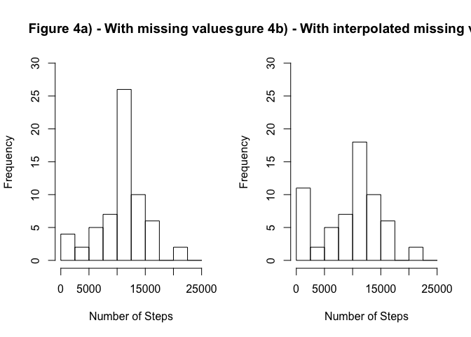
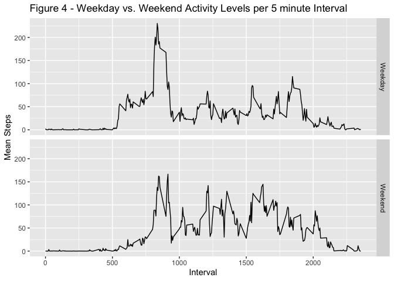
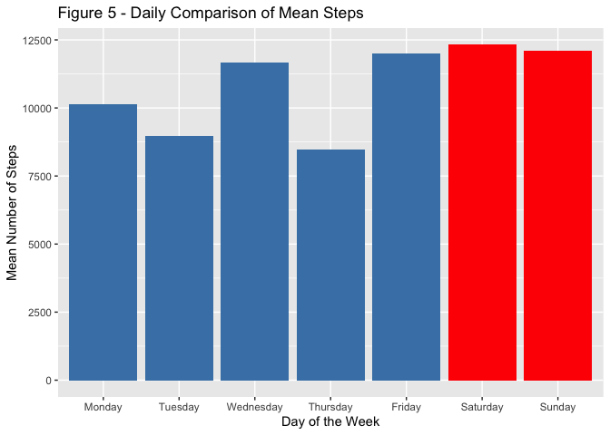
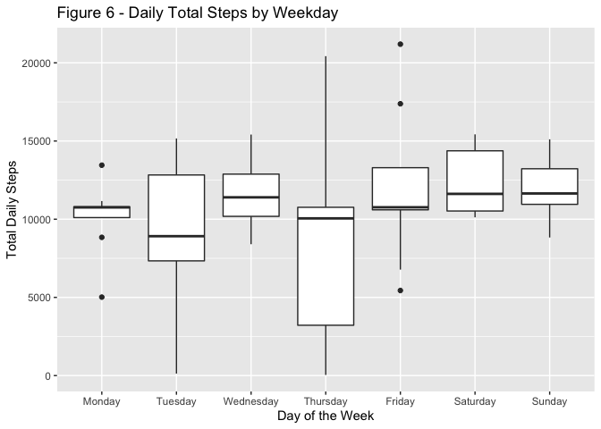

## Loading and preprocessing the data

```r
if(!file.exists("data")) {dir.create("data")}
if(!file.exists("data/activity.csv")) {unzip("activity.zip", exdir = "./data")}
data <- read.csv(file = "./data/activity.csv")
data[,4] <- data$interval%%100
data[,5] <- data$interval%/%100
data[,6] <- data$date
names(data)[4:6] <- c("minute","hour","year-hour:minute")
data$minute <- sapply(data$minute, function(x) {
        if(x < 10) {paste("0",x, sep = "")}
        else {return(x)}
})
data$hour <- sapply(data$hour, function(x) {
        if(x < 10) {paste("0",x, sep = "")}
        else {return(x)}
})
data[,6] <- paste(data$date," ",data$hour,":",data$minute, sep = "")
names(data)[4:6] <- c("minute","hour","year-hour:minute")
data[,6] <- paste(data$date," ",data$hour,":",data$minute, sep = "")
data$date <- as.POSIXct(data$`year-hour:minute`, format = "%Y-%m-%d %H:%M")
data <- data[-c(4:6)]
```

## What is mean total number of steps taken per day?

```r
require("dplyr", lib.loc = "http://cran.us.r-project.org")
library(dplyr)
daily <- data %>%
        group_by(as.Date(date)) %>%
        summarise(total = sum(steps, na.rm = TRUE))
daily <- daily[-1,]
daily_mean <- mean(daily$total)
daily_median <- median(daily$total)
uncorrected <- hist(daily$total, 
     xlab = "Number of steps", 
     ylim = c(0,30), 
     main = "Figure 1 - Total steps per day over a two month period.", 
     breaks = c(seq(from = 0, to = 25000, by = 2500)), 
     xlim = c(0,25000))
abline(v = daily_mean, col = "red", lty =2)
abline(v = daily_median, col = "blue", lty =2)
legend("topright", 
       col = c("red","blue"), 
       lty = 2, 
       legend = c("mean", "median"))
```

<!-- -->

The histogram for the activity levels during this period can be seen in **Figure 1.**The mean number of steps taken per day between the 1st October 2012 and the 30th
of November 2012 was **9,354** and the median was **10,389**.

## What is the average daily activity pattern?


```r
daily_interval <- data %>%
        arrange(interval) %>% 
        group_by(interval) %>%
        summarise(mean_steps = mean(steps, na.rm = TRUE))
daily_interval$hours <- daily_interval$interval %/% 100
daily_interval$minutes <- daily_interval$interval %% 100
daily_interval$minutes <- sapply(daily_interval$minutes,
                                function(x) {
                                        if(x < 10) {
                                                paste("0",x, sep = "")
                                        } else {return(x)}
                                         
                                 })
daily_interval$hours <- sapply(daily_interval$hours,
                                function(x) {
                                        if(x < 10) {
                                                paste("0",x, sep = "")
                                        } else {return(x)}
                                         
                                 })
daily_interval$time_of_day <- with(daily_interval, 
                                   paste(hours,":",minutes, sep = ""))
daily_interval$time_of_day <- as.POSIXct(daily_interval$time_of_day,
                                         format = "%H:%M")
with(data=daily_interval, 
     plot(time_of_day, 
          mean_steps, type = "l", 
          xlab = "Time of day", ylab = "Mean number of steps per day"),             xlim = c(0,24:00))
highest_activity <- max(daily_interval$mean_steps, na.rm = TRUE)
highest_entry <- daily_interval[daily_interval$mean_steps == highest_activity,]
abline(v = highest_entry$time_of_day, col = "red", lty = 2)
legend("topright", 
       lty = 2, 
       col = "red", 
       legend = "8:30am - 8:35am")
```

<!-- -->

The interval of the day that sees the highest mean number of steps is between  **830am** and **835am** .

## Inputing missing values


```r
sum_of_NA <- sum(is.na(data$steps))
percentage_of_NA <- 100 * sum_of_NA/sum(!is.na(data$steps))

data_clone <- data

for (i in 1:length(data_clone$steps)) {
                if(is.na(data_clone$steps[i])) {
                        interval <- data_clone$interval[i]
                        data_clone$steps[i] <- 
                                round(daily_interval[daily_interval$interval 
                                               == interval, 2], digits = 0)
                }
}
data_clone_stats <- data_clone %>%
        group_by(as.Date(date)) %>%
        summarise(total = sum(as.numeric(steps)))
clone_mean <- mean(data_clone_stats$total)
clone_median <- median(data_clone_stats$total)
```

There are a total of **2,304** missing number of steps in this dataset. This represents **15.1%** of the available data. 

Missing values have been filled by replacing the mean number of steps for the appropriate interval found in the rest of the dataset. This dataset with interpolated missing values can be seen in **Figure 2**.


```r
corrected <- hist(data_clone_stats$total, xlab = "Total number of steps", 
     main = "Figure 2 - Interpolated total number of steps over a two month period", 
     ylim = c(0,30), 
     breaks = c(seq(from = 0, to = 25000, by = 2500)), 
     xlim = c(0,25000))
abline(v = clone_mean, lty = 2, col = "red")
abline(v = clone_median, lty = 2, col = "blue")
legend("topright", 
       col = c("red", "blue"), 
       legend = c("mean", "median"),
       lty = 2)
```

<!-- -->

The mean number of steps taken per day between the 1st October 2012 and the 30th
of November 2012 using correct data was **10,592** and the median was **10,762**. 

This makes a notable change to the results without correction shown in **Figure 1**. **Figure 3** shows the change in results of including interpolated values for missing data.


```r
par(mfrow = c(1,2))
plot(corrected,ylim = c(0,30), 
     main = "Figure 4a) - With missing values", 
     xlab = "Number of Steps")
plot(uncorrected, ylim = c(0,30), 
     main = "Figure 4b) - With interpolated missing values",
     xlab = "Number of Steps")
```

<!-- -->

The effect of interpolating missing values is to significantly reduce the frequency of the smallest bin (0 - 2500) and increase the frquency of the most common bin (10,000 -12,500). This realignment of the data accounts for the increases in mean and median observed.

## Are there differences in activity patterns between weekdays and weekends?


```r
daily_corrected <- data_clone %>%
        group_by(as.Date(date)) %>%
        summarise(total = sum(as.numeric(steps), na.rm = TRUE))
names(daily_corrected)[1] <- "date"
daily_corrected$day <- weekdays(daily_corrected$date)
daily_corrected <- daily_corrected[-1,]
weekdays <- subset(daily_corrected, day == "Monday" |
                           day == "Tuesday" |
                           day == "Wednesday" |
                           day == "Thursday" |
                           day == "Friday")
weekends <- subset(daily_corrected, day == "Saturday" |
                           day == "Sunday")
mean_weekdays <- weekdays %>%
        group_by(day) %>%
        summarise(mean_steps = mean(total, na.rm = TRUE))
mean_weekends <- weekends %>%
        group_by(day) %>%
        summarise(mean_steps = mean(total, na.rm = TRUE))
```


```r
data_clone$weekday <- weekdays(data_clone$date)
data_clone$type_of_day <- sapply(data_clone$weekday, function(x) {
                if(x == "Monday" | x == "Tuesday" | x == "Wednesday" | x == "Thursday" | x == "Friday") {return("Weekday")}
                else {return("Weekend")}
})

type_of_day_summary <- data_clone %>%
        group_by(type_of_day, interval) %>%
        summarise(mean_steps = mean(as.numeric(steps), na.rm = TRUE))

require(ggplot2)
qplot(interval, mean_steps, data = type_of_day_summary, facets = type_of_day~., geom = "line", xlab = "Interval", ylab = "Mean Steps", main = "Figure 4 - Weekday vs. Weekend Activity Levels per 5 minute Interval ")
```

<!-- -->

**Figure 4** shows the difference in the mean number of steps over the course of 24 hours for this dataset. Weekday activity seems to be more pronounced between 7:30 am and 10:am, perhaps correlating with commute time. General activity during waking hours over the weekend however, seems to be higher. 

The activity patterns for Monday to Sunday over this period can be seen below in **Figure 5.**


```r
all_week <- rbind(mean_weekdays, mean_weekends)
DOW <- c("Monday", "Tuesday", "Wednesday", "Thursday", "Friday", "Saturday", "Sunday")
all_week$day <- factor(all_week$day, levels = DOW)
all_week <- all_week[order(all_week$day),]

require(ggplot2)
colours <- c(rep("steelblue",5), rep("red",2))
g <- ggplot(data = all_week, aes(x = day, y = mean_steps)) + geom_col(fill = colours)
g <- g + xlab("Day of the Week")
g <- g + ylab("Mean Number of Steps")
g <- g + labs(title = "Figure 5 - Daily Comparison of Mean Steps")
show(g)
```

<!-- -->

Both days of the weekend have higher mean activity levels compared to weekdays. There appears to be a significant decline in activity on a Tuesday and Thursday.
This may suggest that the user is more active on a weekend, although other causes, such as consistent use during the week, would need to be ruled out first.

**Figure 6** shows the dispersion for the data in question.


```r
weekdays_weekends <- rbind(weekdays, weekends)
weekdays_weekends$day <- factor(weekdays_weekends$day, levels = DOW)
weekdays_weekends <- weekdays_weekends[order(weekdays_weekends$day),]

p <- ggplot(weekdays_weekends, aes(x = day, y = total)) + geom_boxplot()
p <- p + xlab("Day of the Week") + ylab("Total Daily Steps")
p <- p + labs(title = "Figure 6 - Daily Total Steps by Weekday")
show(p)
```

<!-- -->

Upon further inspection, the median step count and inter-quartile range appear to be generally consistent in the data from Wednesdays, Fridays, Saturdays and Sundays. Data from Tuesday and Thursday features a significant proportion of low step counts and the cause of this would need to be investigated further before making declarative conclusions about weekday versus weekend activity levels for this individual.
